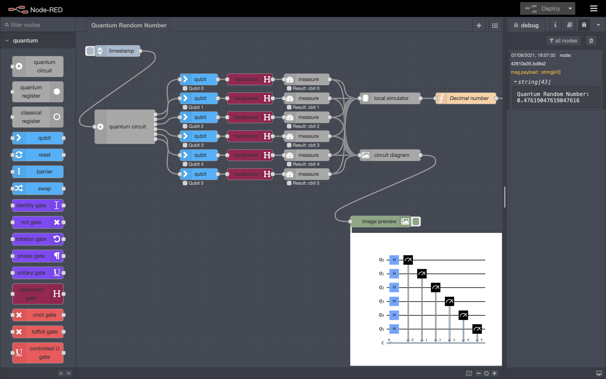

<header><h1 style='font-size: 25pt'>node-red-quantum</h1></header>

# Prologue

**Node-RED Quantum** provides a set of nodes to build and run quantum computing algorithms within Node-RED.

Please be aware that this is a  **development version** of Node-RED Quantum, it is still a work in progress and the code is unstable. A full production-ready release will be published soon.

This module is a user-friendly library that is suitable to new quantum computing users thanks to its extensive documentation. It was designed to facilitate the integration of quantum algorithms within classical programs and is fully scalable since all the elemental quantum operations are included. 

This Node-RED library was developed in the context of a UCL IXN partnership with IBM. Defined and arranged by IBM, the project was allocated to students from UCL's computer science department as part of their Master's thesis. 

For the latest changes, please read the [CHANGELOG](CHANGELOG.md).

For more details on the authors, please read the [AUTHORS](AUTHORS) file.

For information on how to contribute, please read the [CONTRIBUTING](CONTRIBUTING.md) guidelines.

# Table of contents
- [Prologue](#prologue)
- [Table of contents](#table-of-contents)
- [Pre-requisites](#pre-requisites)
- [Install](#install)
- [About Quantum Computing](#about-quantum-computing)
- [*'Quantum'* nodes - Building quantum circuits](#quantum-nodes---building-quantum-circuits)
  - [I - Initialisation nodes](#i---initialisation-nodes)
    - [*Quantum Circuit* node](#quantum-circuit-node)
    - [*Quantum Register* node](#quantum-register-node)
    - [*Classical Register* node](#classical-register-node)
  - [II - Qubit control nodes](#ii---qubit-control-nodes)
    - [*Qubit* node](#qubit-node)
    - [*Reset* node](#reset-node)
    - [*Barrier* node](#barrier-node)
    - [*SWAP* node](#swap-node)
  - [III - Quantum gate nodes](#iii---quantum-gate-nodes)
    - [*Identity Gate* node](#identity-gate-node)
    - [*NOT Gate* node](#not-gate-node)
    - [*Rotation Gate* node](#rotation-gate-node)
    - [*Phase Gate* node](#phase-gate-node)
    - [*Unitary Gate* node](#unitary-gate-node)
    - [*Hadamard Gate* node](#hadamard-gate-node)
    - [*CNOT Gate* node](#cnot-gate-node)
    - [*TOFFOLI Gate* node](#toffoli-gate-node)
    - [*Controlled-U Gate* node](#controlled-u-gate-node)
    - [*Multi-controlled-U Gate* node](#multi-controlled-u-gate-node)
  - [IV - Circuit output nodes](#iv---circuit-output-nodes)
    - [*Measure* node](#measure-node)
    - [*Bloch Sphere* node](#bloch-sphere-node)
    - [*Circuit Diagram* node](#circuit-diagram-node)
    - [*Script* node](#script-node)
    - [*Local Simulator* node](#local-simulator-node)
    - [*IBM Quantum System* node](#ibm-quantum-system-node)
- [*'Quantum Algorithms'* nodes - Leveraging quantum computing](#quantum-algorithms-nodes---leveraging-quantum-computing)
    - [Grover's algorithm](#grovers-algorithm)
    - [Shor's algorithm](#shors-algorithm)

# Pre-requisites
Node-RED Quantum requires at minimum [Node-RED 1.0](https://nodered.org) and [Python 3](https://www.python.org/).

# Install

# About Quantum Computing

# *'Quantum'* nodes - Building quantum circuits

## I - Initialisation nodes

### *Quantum Circuit* node

### *Quantum Register* node

### *Classical Register* node

## II - Qubit control nodes

### *Qubit* node

### *Reset* node

### *Barrier* node

### *SWAP* node

## III - Quantum gate nodes

### *Identity Gate* node

### *NOT Gate* node

### *Rotation Gate* node

### *Phase Gate* node

### *Unitary Gate* node

### *Hadamard Gate* node

### *CNOT Gate* node

### *TOFFOLI Gate* node

### *Controlled-U Gate* node

### *Multi-controlled-U Gate* node

## IV - Circuit output nodes

### *Measure* node

### *Bloch Sphere* node

### *Circuit Diagram* node

### *Script* node

### *Local Simulator* node

### *IBM Quantum System* node

# *'Quantum Algorithms'* nodes - Leveraging quantum computing

### Grover's algorithm

### Shor's algorithm